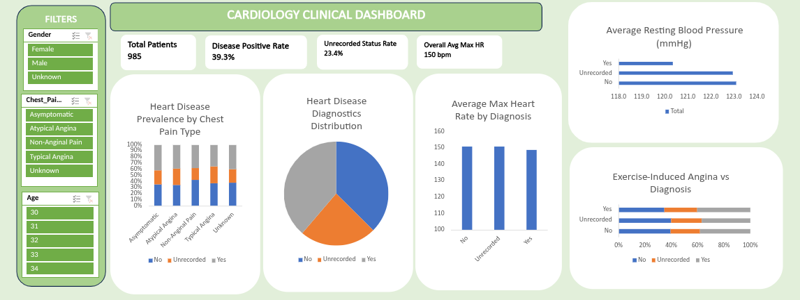

# 🩺 Clinical Data Quality & Cardiology Diagnostic Analytics Dashboard

## 📌 Executive Summary
Healthcare facilities often struggle with missing, unrecorded, or inconsistent clinical records across patient admissions. Incomplete data in vital metrics—such as blood pressure, heart rate, and chest pain classification—impairs clinical risk assessment and skews diagnostic reporting.

This project delivers an end-to-end data cleaning pipeline and an interactive executive dashboard designed to evaluate diagnostic patterns and identify clinical record integrity gaps across 985 patient records.

---

## 📸 Interactive Dashboard Preview

---

## 🔍 Problem & Business Objectives
* **Standardise Clinical Records:** Implement rigorous data-cleaning protocols to handle missing values (`Unrecorded`), out-of-range clinical anomalies (`Invalid`), and demographic blanks (`Unknown`) without introducing clinical selection bias.
* **Evaluate Diagnostic Patterns:** Identify key risk indicators (e.g., chest pain types, peak heart rates, resting blood pressure) associated with heart disease diagnoses.
* **Deliver Executive Insights:** Provide healthcare administrators with an interactive visual dashboard to segment patient cohorts dynamically by age, gender, and symptom profile.

---

## 🛠️ Tools & Technologies Used
* **Tools:** LibreOffice Calc, Microsoft Excel (PivotTables, PivotCharts, Dynamic Slicers, Custom UI Layout).
* **Techniques:** Data Auditing, Categorical Standardisation, Dynamic Slicer Connections, KPI Card Design, Cross-Tabulation Analysis.

---

## ⚙️ Data Pipeline & Methodology

1. **Record Integrity & Deletion:**
   * Removed **35 duplicate or unidentifiable rows** lacking core `Patient_ID` attributes to preserve strict record traceability.
2. **Standardisation & Explicit Categorisation:**
   * Converted target diagnosis categories (`zero`, `one`, `0`, `1`) into standardised target states: **382 Positive (`Yes`)**, **368 Negative (`No`)**, and **234 `Unrecorded`** cases.
   * Categorised demographic blanks across `Gender` (207 entries) and `Age` (23 entries) as explicit **`Unknown`** states to avoid demographic skew.
3. **Anomaly & Out-of-Range Handling:**
   * Evaluated `ST_Depression` values, flagging **154 out-of-range or negative entries as `Invalid`** and **24 blank entries as `Unrecorded`**.
   * Rounded numeric metrics (blood pressure, cholesterol, max heart rate) to standardised decimal precision.
4. **Dashboard Engineering:**
   * Constructed structured Pivot Tables for core clinical cross-tabulations.
   * Built an interactive executive dashboard featuring custom KPI cards, dynamic slicers, and 5 core clinical visualisations.

---

## 📊 Key Findings & Insights

* **23.8% Unrecorded Diagnostic Target Status:** Out of 985 records, 234 lacked explicit diagnostic target flags, highlighting critical point-of-care data capture gaps.
* **Balanced Active Split:** Among fully documented records, **39.3% (382 patients)** evaluated positive for heart disease, while **37.3% (369 patients)** tested negative.
* **Lower Peak Heart Rate in Positive Cases:** Patients diagnosed with heart disease exhibited a lower average maximum heart rate (**149 bpm**) compared to non-disease patients (**151 bpm**), reflecting reduced exercise tolerance.
* **Exercise-Induced Angina Correlation:** Patients reporting exercise-induced angina accounted for the highest proportion of positive diagnoses (**17.5% of total cohort**).

---

## 💡 Business & Clinical Recommendations
1. **Enforce Mandatory EHR Validation:** Implement strict mandatory fields in Electronic Health Record software to eradicate the 23.4% unrecorded status rate in critical diagnostic metrics.
2. **Prioritise Symptom-Driven Triage:** Establish rapid-screening protocols for patients presenting with exercise-induced angina.
3. **Audit Out-of-Range Measurement Devices:** Investigate diagnostic equipment calibrated for `ST_Depression` readings to address the 154 flagged invalid/out-of-range records.

---

